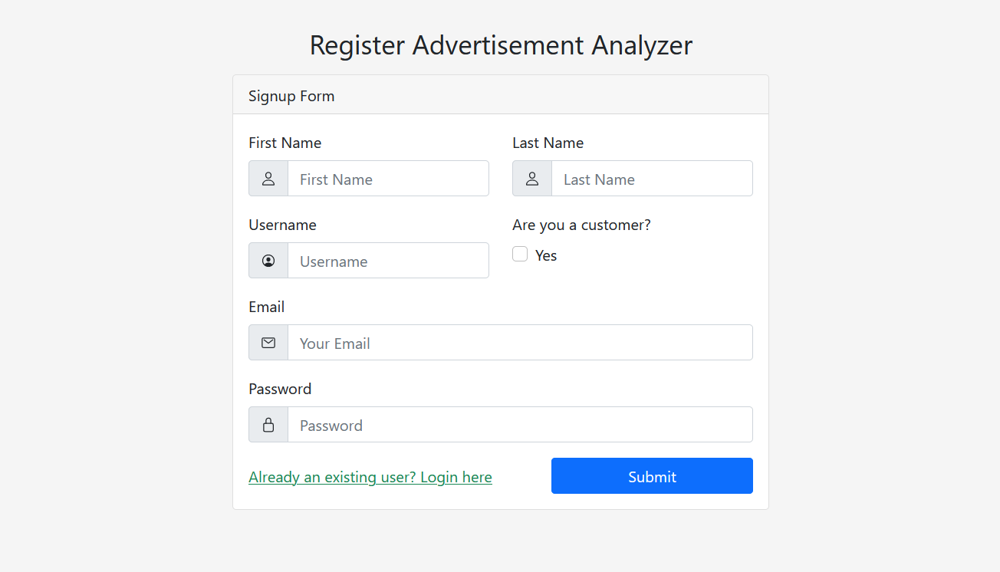
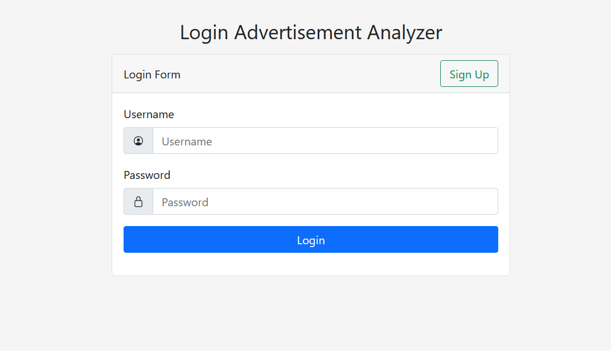
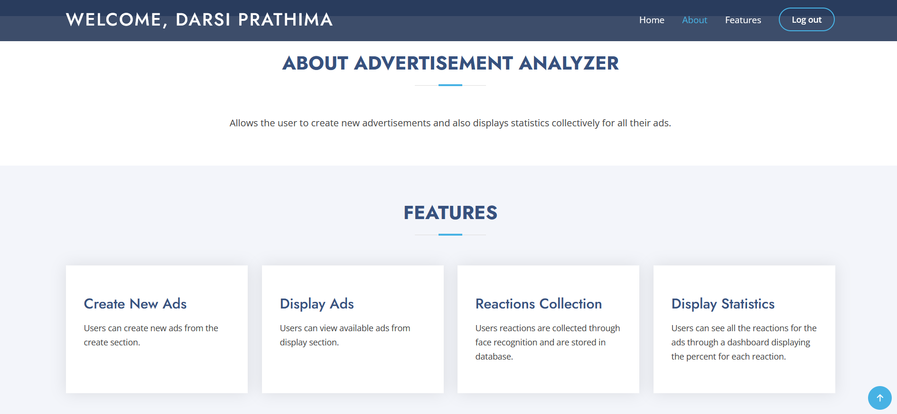
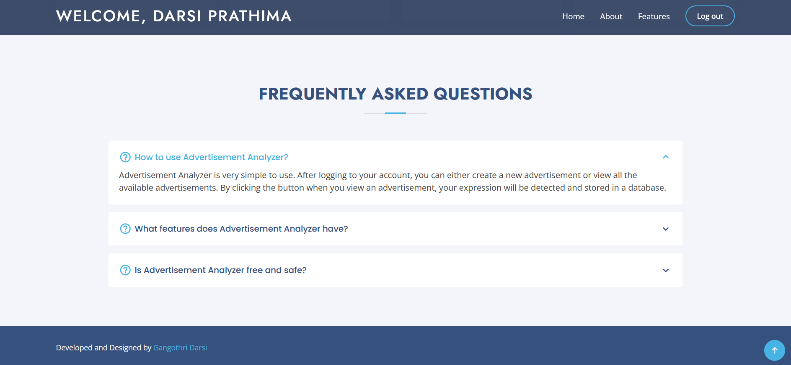
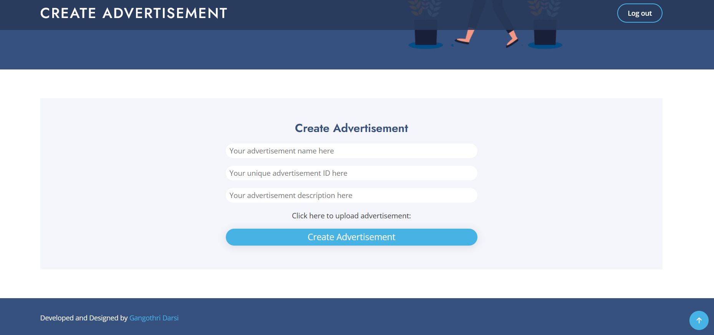
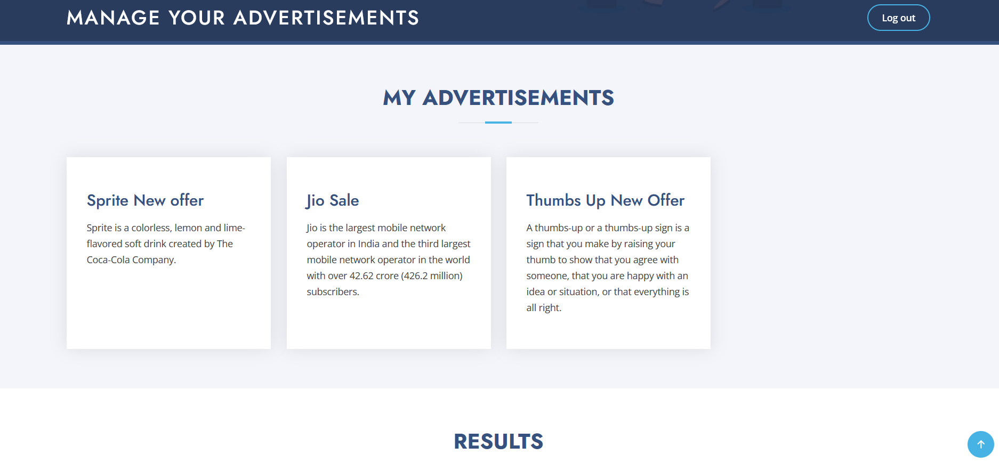
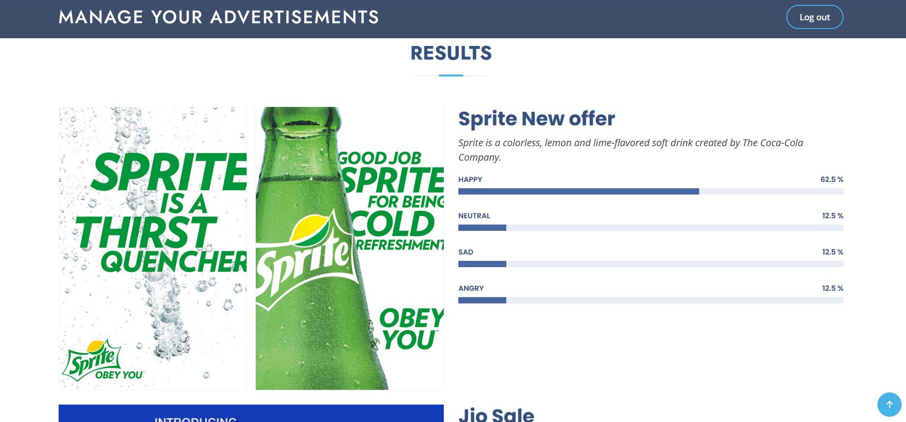
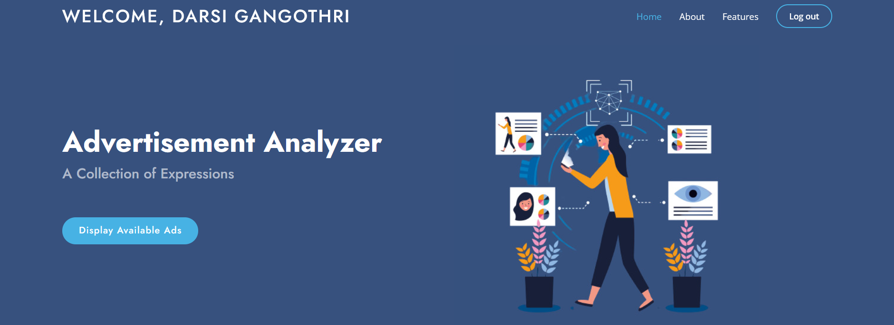
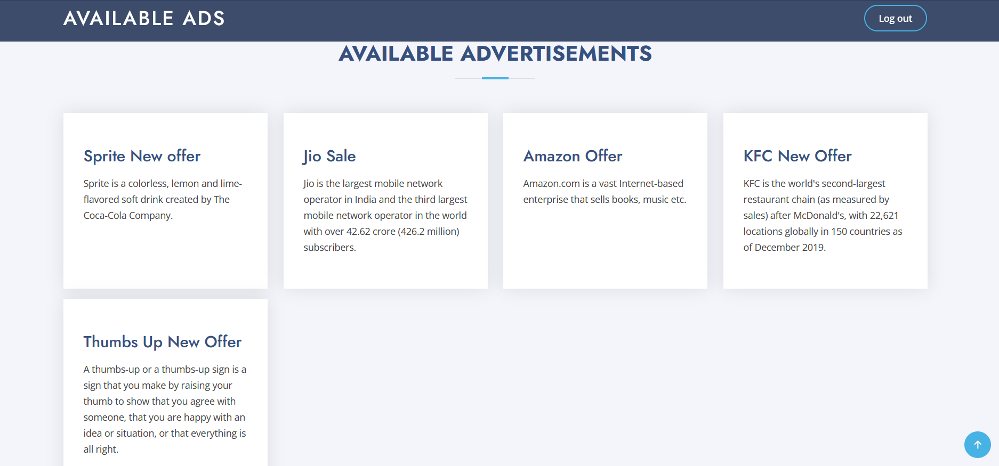
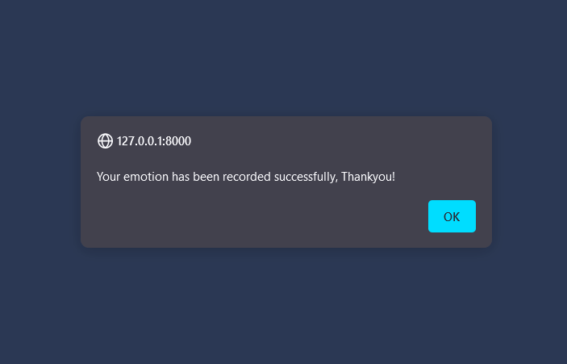

# *MS ENGAGE 2022 - Advertisement Analyzer*

## Installation Guide

* Open `cmd` and type
  * `git clone https://github.com/gangothridarsi/advertisement-analyzer`
* Change directory to `advertisement-analyzer`
* `pip install -r requirements.txt`
* `python manage.py runserver`

1. Create your account as a customer or as an advertisement owner.
   * 
2. login to your account
   * 
3. Home page
   * Home
   * 
   * About and Features
   * 
   * FAQ's
   * 
4. Create an advertisement
   * Enter Ad name
   * Enter unique Ad id
   * Enter Ad description
   * Upload image
   * Click on upload
   * 
5. Manage your ads
   * Display your ads
   * 
   * View statistics
   * 
6. Login as Customer
   * Home Page
   * 
   * Display Available Ads
   * 
   * Click on any advertisement and you emotion will be recognised
   * 

## Points to remember

* Make sure that your system has python installed in it.
* Make sure that you enabled cookies to run the website soomthly.

## Technologies Used

* Python
* Django
* HTML
* CSS
* JS
* Bootstrap
* SQLite
* Git
* Heroku

## Credentials used for demo purpose

* Customer credentials
  * username `dgangothri`
  * password `dg06`
* Owner credentials
  * username `dprathima`
  * password `dp26`

## Video Demo

* [Video Demo](https://drive.google.com/file/d/1BfK2MdMYoq2w2roZyU_MpR-Cc_gk-sFD/view?usp=sharing)

## GIT URL

* [Git Repo URL](https://github.com/gangothridarsi/advertisement-analyzer.git)
  